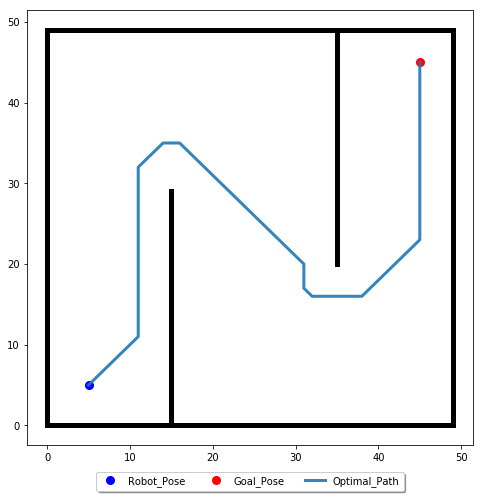
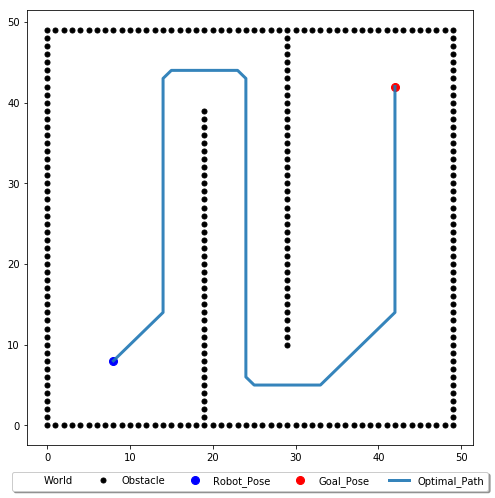

# Path-Planning algorithms implemented in Python

(1) A* : graph search algorithm to solve optimal solution for path planning problems

The path found will be like shown in the figure below:

If we want to keep our robot stay a specific distance from obstacle for safety consideration, the path found will be like shown in the figure below:

(2) RRT & RRT* : sampled based algorithm to solve path planning problems
